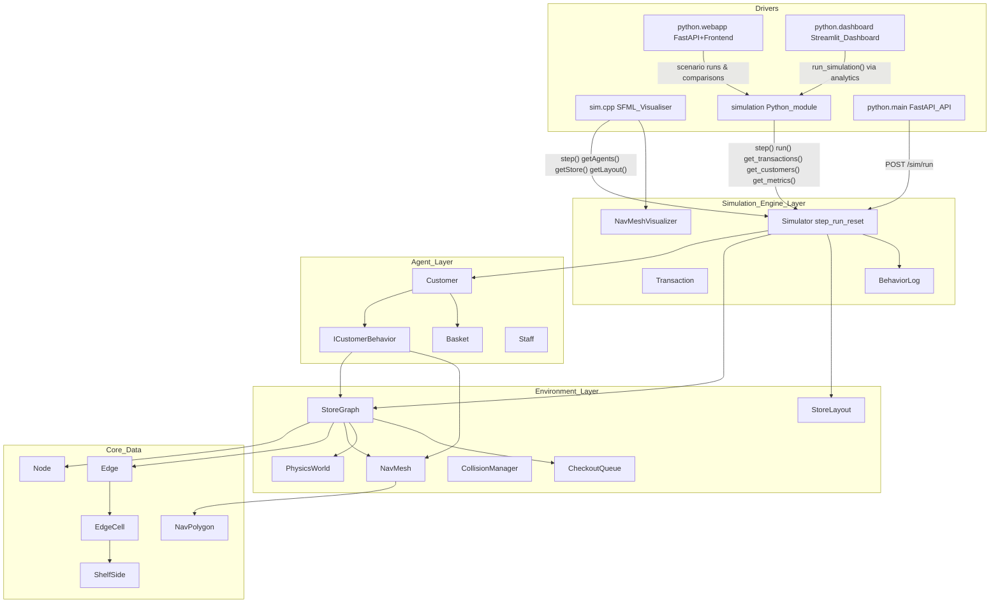
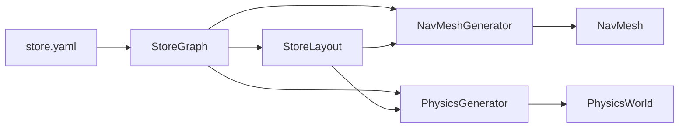
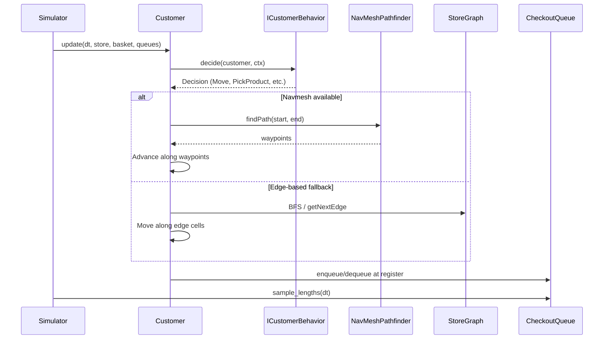

# PriceRiot C++ Architecture

This document describes the layered abstraction and data flows of the PriceRiot retail simulation engine.

## Layered Abstraction Diagram

## Module Responsibilities

### engine

- **simulator.cpp/h**: Headless simulation core. Owns store graph, layout, agents, collision manager, checkout queues, and RNG. Exposes `step(dt)`, `run(duration, dt)`, `reset()`, and accessors for transactions, customers, and state. No SFML/ImGui; used by both the visualiser and the Python module.
- **sim.cpp**: SFML visualiser. Creates a `Simulator`, drives it with `step(dt)` each frame, and renders using `getAgents()`, `getStore()`, `getLayout()`. All simulation logic lives in `Simulator`.
- **transaction.cpp/h**: Transaction and line-item generation, CSV export.
- **navmesh_visualizer.cpp/h**: SFML drawing of navmesh polygons, agent paths, and debug overlays.
- **behavior_log.cpp/h**: Structured logging of agent decisions and state transitions for debugging and analytics.
- **metrics/heatmap helpers (within simulator/environment)**: Aggregate per-edge and per-cell visit counts, queue length histories, and other metrics that are exposed via the C++ API and surfaced in Python analytics.

### bindings

- **priceriot_bindings.cpp**: pybind11 Python extension module `simulation`. Exposes `Simulator`, `Transaction`, `Customer`, `LineItem`, `TripPurpose` for headless runs and analytics. Built with the same C++ core as the simulator executable (no SFML).

On top of this extension:

- `python/analytics/core.py` wraps the raw C++ API with higher-level helpers that return pandas DataFrames (transactions, customers, heatmaps, queue metrics).
- `python/run_analysis.py` provides a CLI to run headless simulations and export CSVs into `data/processed/`.
- `python/simulate.py` offers a lighter-weight script wrapper for `run_simulation` suitable for notebooks and batch tooling.
- `python/main.py` exposes a FastAPI service (`POST /sim/run`) that runs bounded-duration simulations per request.
- `python/webapp/` contains a FastAPI-based web application and persistence layer for scenario comparison and result storage.
- `python/dashboard/app.py` implements a Streamlit dashboard for interactive simulation and POS analytics.

### agents

- **customer.cpp/h**: Customer entity with demographics, behavior profile, navigation state (edge-based or navmesh), basket, and loyalty metrics.
- **customer_behavior.cpp/h**: Strategy pattern for customer AI. `ICustomerBehavior::decide()` returns a `Decision` (Move, PickProduct, Checkout, etc.). `DefaultBehavior` (browsing) and `MissionBehavior` (targeted SKU list).
- **basket.cpp/h**: Shopping basket with SKU/quantity tracking.
- **staff.cpp/h**: StockBoy restocking logic.

### environment

- **environment.cpp/h**: Core graph model. `Node` (Entrance, Exit, Junction, Register, Stockroom), `Edge` (aisles with cells), `StoreGraph` (nodes, edges, adjacency, navmesh, physics world). YAML loading via `loadFromYaml()`.
- **cell.cpp/h**: `EdgeCell` – longitudinal slice of an aisle with left/right `ShelfSide`, `SideBand` stall management, peel/pick/merge operations.
- **shelf.cpp/h**: Bay → Face → Slot hierarchy. `ShelfSide`, `SideBand`, `BayFace`, `PickResult`. Planogram mapping.
- **store_layout.cpp/h**: `StoreLayout` – geometry for visualization (node hubs, edge centerlines, corners).
- **navmesh.cpp/h**: `NavPolygon`, `NavMesh` – walkable polygons and spatial queries (find polygon containing point).
- **navmesh_generator.cpp/h**: Builds `NavMesh` from `StoreGraph` and `StoreLayout`.
- **navmesh_pathfinder.cpp/h**: A* pathfinding on navmesh with funnel-algorithm path smoothing.
- **physics.cpp/h**: `PhysicsWorld` – obstacle AABBs and boundary walls for collision.
- **physics_generator.cpp/h**: Generates physics from layout (shelf obstacles, walls).
- **collision_manager.cpp/h**: Agent-agent separation, obstacle avoidance, collision resolution.
- **products.cpp/h**: Product catalog, SKU definitions.
- **store_init.cpp/h**, **store_inventory.cpp/h**: YAML parsing, planogram application, inventory pools.

## Key Data Flows

1. **YAML → StoreGraph**: `StoreGraph::loadFromYaml()` parses nodes, edges, cells, planograms, checkout queues, and products.
2. **StoreGraph → NavMesh/Physics**: `StoreGraph::buildNavMesh(layout)` and `buildPhysicsWorld(layout)` (via `NavMeshGenerator` and `PhysicsGenerator`) produce walkable polygons and collision geometry.
3. **Customer → Behavior → Pathfinding**: Each tick, `Customer::update()` calls `behavior->decide()`. The decision drives edge-based movement (BFS on graph) or navmesh movement (`NavMeshPathfinder::findPath()`), depending on whether a navmesh is available.
4. **Queues and Metrics**: Checkout queues record arrivals/departures and sample queue lengths over time; the simulator aggregates per-cell heatmaps and queue metrics which are accessed via the `simulation` bindings and converted to DataFrames in `python/analytics/core.py`.

## Behavior and Navigation Flow

- **DefaultBehavior**: Entering → Browsing (with preferred aisles) → HeadingToCheckout → InQueue → HeadingToExit → Done.
- **MissionBehavior**: Entering → MissionBrowse (visit cells containing target SKUs) → HeadingToCheckout → InQueue → HeadingToExit → Done.
- **Hybrid navigation**: When navmesh is built, agents use `NavMeshPathfinder`. Otherwise they use graph-based edge traversal.
